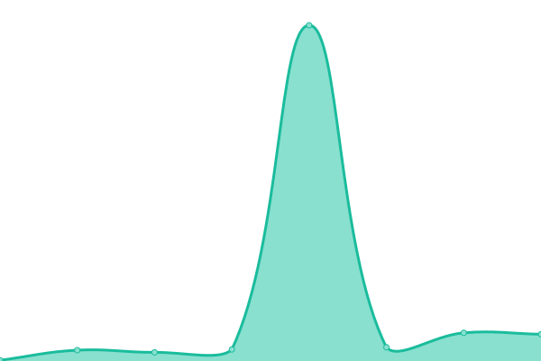
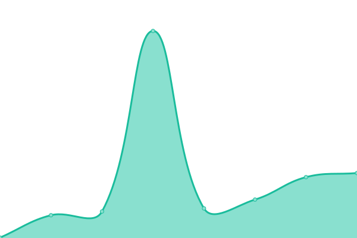
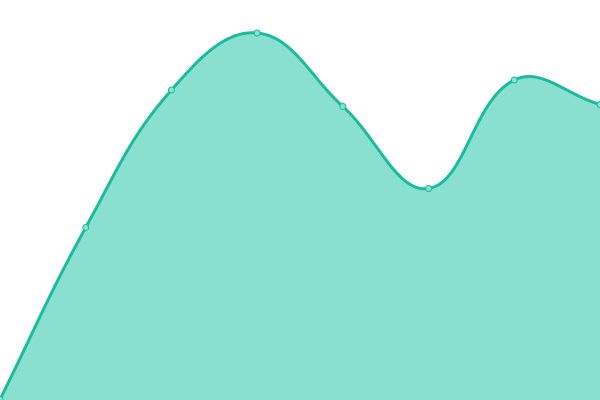
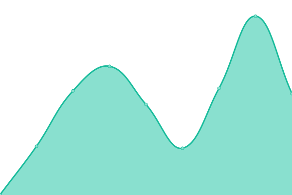
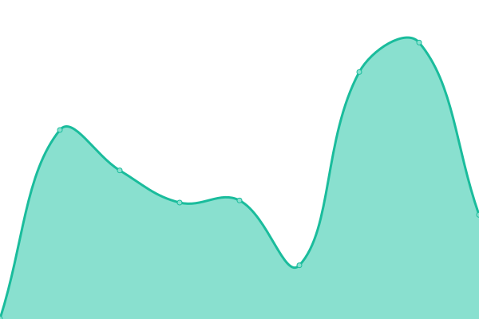
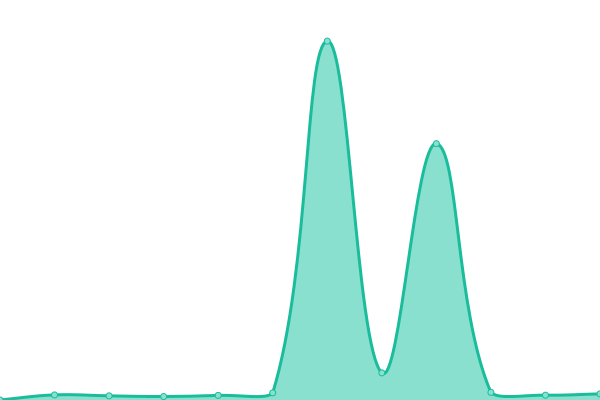
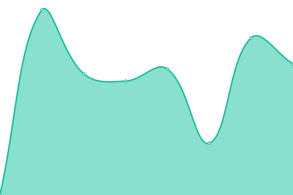
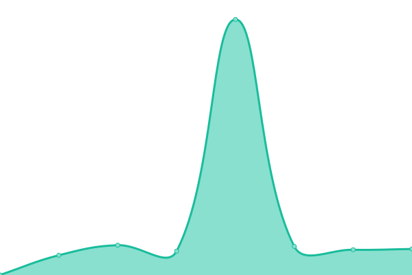
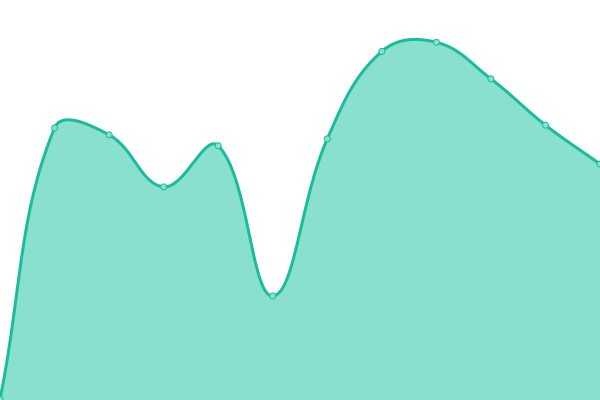

# [📈 Live Status](https://status.spollock.ca): <!--live status--> **🟧 Partial outage**

This repository contains the open-source uptime monitor and status page for [Spencer Pollock](http://www.spollock.ca), powered by [Upptime](https://github.com/upptime/upptime).

With [Upptime](https://upptime.js.org), you can get your own unlimited and free uptime monitor and status page, powered entirely by a GitHub repository. We use [Issues](https://github.com/srepollock/upptime/issues) as incident reports, [Actions](https://github.com/srepollock/upptime/actions) as uptime monitors, and [Pages](https://status.spollock.ca) for the status page.

<!--start: status pages-->
<!-- This summary is generated by Upptime (https://github.com/upptime/upptime) -->
<!-- Do not edit this manually, your changes will be overwritten -->
<!-- prettier-ignore -->
| URL | Status | History | Response Time | Uptime |
| --- | ------ | ------- | ------------- | ------ |
|  [spollock.ca](https://spollock.ca) | 🟩 Up | [spollock-ca.yml](https://github.com/srepollock/upptime/commits/HEAD/history/spollock-ca.yml) | 

 133ms
     
 | 

<a href="https://srepollock.github.io/upptime/history/spollock-ca">100.00%</a>
    

|  [srepollock.ca](https://srepollock.ca) | 🟥 Down | [srepollock-ca.yml](https://github.com/srepollock/upptime/commits/HEAD/history/srepollock-ca.yml) | 

 0ms
     
 | 

<a href="https://srepollock.github.io/upptime/history/srepollock-ca">0.00%</a>
    

|  [srepollock.dev](https://srepollock.dev) | 🟥 Down | [srepollock-dev.yml](https://github.com/srepollock/upptime/commits/HEAD/history/srepollock-dev.yml) | 

 131ms
     
 | 

<a href="https://srepollock.github.io/upptime/history/srepollock-dev">0.00%</a>
    

|  [srepollock.io](https://srepollock.io) | 🟩 Up | [srepollock-io.yml](https://github.com/srepollock/upptime/commits/HEAD/history/srepollock-io.yml) | 

 90ms
     
 | 

<a href="https://srepollock.github.io/upptime/history/srepollock-io">100.00%</a>
    

|  [spollock.xyz](https://spollock.xyz) | 🟥 Down | [spollock-xyz.yml](https://github.com/srepollock/upptime/commits/HEAD/history/spollock-xyz.yml) | 

 0ms
     
 | 

<a href="https://srepollock.github.io/upptime/history/spollock-xyz">100.00%</a>
    

|  [Discord](https://discordstatus.com/) | 🟩 Up | [discord.yml](https://github.com/srepollock/upptime/commits/HEAD/history/discord.yml) | 

 265ms
     
 | 

<a href="https://srepollock.github.io/upptime/history/discord">100.00%</a>
    

|  [Github](https://www.githubstatus.com/) | 🟩 Up | [github.yml](https://github.com/srepollock/upptime/commits/HEAD/history/github.yml) | 

 226ms
     
 | 

<a href="https://srepollock.github.io/upptime/history/github">100.00%</a>
    

|  [Google](https://www.google.com) | 🟩 Up | [google.yml](https://github.com/srepollock/upptime/commits/HEAD/history/google.yml) | 

 71ms
     
 | 

<a href="https://srepollock.github.io/upptime/history/google">100.00%</a>
    

|  [Google Workspaces](https://www.google.com/appsstatus/dashboard/) | 🟩 Up | [google-workspaces.yml](https://github.com/srepollock/upptime/commits/HEAD/history/google-workspaces.yml) | 

 52ms
     
 | 

<a href="https://srepollock.github.io/upptime/history/google-workspaces">100.00%</a>
    

|  [Google Cloud Platform](https://status.cloud.google.com/) | 🟩 Up | [google-cloud-platform.yml](https://github.com/srepollock/upptime/commits/HEAD/history/google-cloud-platform.yml) | 

 140ms
     
 | 

<a href="https://srepollock.github.io/upptime/history/google-cloud-platform">100.00%</a>
    

|  [Amazon](https://amazon.ca) | 🟩 Up | [amazon.yml](https://github.com/srepollock/upptime/commits/HEAD/history/amazon.yml) | 

 387ms
     
 | 

<a href="https://srepollock.github.io/upptime/history/amazon">100.00%</a>
    

|  [AWS](https://health.aws.amazon.com/health/status) | 🟩 Up | [aws.yml](https://github.com/srepollock/upptime/commits/HEAD/history/aws.yml) | 

 383ms
     
 | 

<a href="https://srepollock.github.io/upptime/history/aws">100.00%</a>
    

|  [Firebase](https://status.firebase.google.com/) | 🟩 Up | [firebase.yml](https://github.com/srepollock/upptime/commits/HEAD/history/firebase.yml) | 

 343ms
     
 | 

<a href="https://srepollock.github.io/upptime/history/firebase">100.00%</a>
    

|  [Docker](https://status.docker.com/) | 🟩 Up | [docker.yml](https://github.com/srepollock/upptime/commits/HEAD/history/docker.yml) | 

 359ms
     
 | 

<a href="https://srepollock.github.io/upptime/history/docker">100.00%</a>
    

|  [Medium](https://medium.statuspage.io/) | 🟩 Up | [medium.yml](https://github.com/srepollock/upptime/commits/HEAD/history/medium.yml) | 

 287ms
     
 | 

<a href="https://srepollock.github.io/upptime/history/medium">100.00%</a>
    

|  [Notion](https://status.notion.so/) | 🟩 Up | [notion.yml](https://github.com/srepollock/upptime/commits/HEAD/history/notion.yml) | 

 361ms
     
 | 

<a href="https://srepollock.github.io/upptime/history/notion">100.00%</a>
    

|  [Twitter](https://api.twitterstat.us/) | 🟩 Up | [twitter.yml](https://github.com/srepollock/upptime/commits/HEAD/history/twitter.yml) | 

 231ms
     
 | 

<a href="https://srepollock.github.io/upptime/history/twitter">100.00%</a>
    

|  [Facebook](https://status.fb.com/) | 🟩 Up | [facebook.yml](https://github.com/srepollock/upptime/commits/HEAD/history/facebook.yml) | 

 293ms
     
 | 

<a href="https://srepollock.github.io/upptime/history/facebook">100.00%</a>
    

|  [Twitch](https://status.twitch.tv/) | 🟩 Up | [twitch.yml](https://github.com/srepollock/upptime/commits/HEAD/history/twitch.yml) | 

 305ms
     
 | 

<a href="https://srepollock.github.io/upptime/history/twitch">100.00%</a>
    

|  [Reddit](https://reddit.statuspage.io/) | 🟩 Up | [reddit.yml](https://github.com/srepollock/upptime/commits/HEAD/history/reddit.yml) | 

 377ms
     
 | 

<a href="https://srepollock.github.io/upptime/history/reddit">100.00%</a>
    

|  [Instagram](https://instagram.com) | 🟩 Up | [instagram.yml](https://github.com/srepollock/upptime/commits/HEAD/history/instagram.yml) | 

 784ms
     
 | 

<a href="https://srepollock.github.io/upptime/history/instagram">100.00%</a>
    

|  [Snapchat](https://www.snapchat.com/) | 🟥 Down | [snapchat.yml](https://github.com/srepollock/upptime/commits/HEAD/history/snapchat.yml) | 

 3180ms
     
 | 

<a href="https://srepollock.github.io/upptime/history/snapchat">100.00%</a>
    

|  [Wikipedia](https://en.wikipedia.org) | 🟩 Up | [wikipedia.yml](https://github.com/srepollock/upptime/commits/HEAD/history/wikipedia.yml) | 

 308ms
     
 | 

<a href="https://srepollock.github.io/upptime/history/wikipedia">100.00%</a>
    

|  [Hacker News](https://news.ycombinator.com) | 🟩 Up | [hacker-news.yml](https://github.com/srepollock/upptime/commits/HEAD/history/hacker-news.yml) | 

 266ms
     
 | 

<a href="https://srepollock.github.io/upptime/history/hacker-news">99.83%</a>
    

|  [Netflix](https://help.netflix.com/en/is-netflix-down) | 🟩 Up | [netflix.yml](https://github.com/srepollock/upptime/commits/HEAD/history/netflix.yml) | 

 377ms
     
 | 

<a href="https://srepollock.github.io/upptime/history/netflix">100.00%</a>
    

|  [PrimeVideo](https://primevideo.com) | 🟩 Up | [prime-video.yml](https://github.com/srepollock/upptime/commits/HEAD/history/prime-video.yml) | 

 561ms
     
 | 

<a href="https://srepollock.github.io/upptime/history/prime-video">100.00%</a>
    

|  [Disney+](https://disneyplus.com) | 🟩 Up | [disney.yml](https://github.com/srepollock/upptime/commits/HEAD/history/disney.yml) | 

 470ms
     
 | 

<a href="https://srepollock.github.io/upptime/history/disney">100.00%</a>
    

<!--end: status pages-->

[**Visit our status website →**](https://status.spollock.ca)

## 📄 License

- Powered by: [Upptime](https://github.com/upptime/upptime)
- Code: [MIT](./LICENSE) © [Spencer Pollock](http://www.spollock.ca)
- Data in the `./history` directory: [Open Database License](https://opendatacommons.org/licenses/odbl/1-0/)
